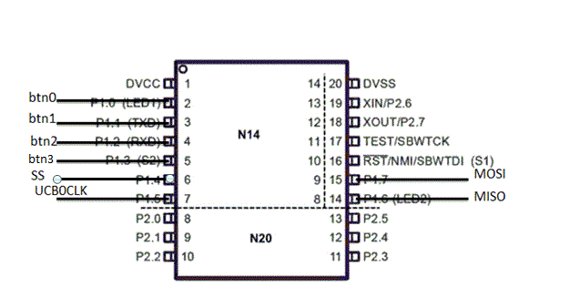

# Lab05

## Objective / Purpose
The purpose of this lab is to utilize the knowledge of timers and interrupts to create a 2D game that is controllable through user button input.  The buttons should be trigegred using interrupts.  In addition the timer is used to determine whether the player has taken to long to make a move and lose the game.
## Preliminary Design
The first part of this lab will be to implement the logic for the game.  by designing it in a way that will allow for easy implentation with my LCDDriver will allow for the two libraries to be combined in a short amount of time.  The logic for the interrupts and timer will be the last compenent to be added to the design.
### Software Flow Chart / Algorithms

### Hardware Schematic

## Implementation 
This part gets slightly tricky.  The TemplateGame allowed for everything from the player, bombs, to the string representation of the board tobe abstracted away.  The only thing the main file had to do was see whether it could make a move and how type of code the game board gave back after the attempted move. 
 
The main file had two significant logical segments. 
 
The main while loop determined which interrupt had triggered, telling the counter to increase or try to move the player in a direction.  In addition, the while loop tested to see whether the two different losing conditions had been met or if the player had reached the victory position on the board. 
 
The interrupts were set up on pins 1.0-1.4 to account for the buttons.  The button interrupts modified the edge they triggered on to allow for effective debouncing when the user released the button.  The only variable set is the global flag variable for the main while loop to work with. 
 
The timer interrupt triggers about ever half second and sets the flag for the main while to increment the counter to determine the total amount of time that has passed.

## Testing Methodology / Results

## Observations and Conclusions 
An increased amount of effort needs to be implemented before writing code.  A significant portion, 3/4, of my time was spent debugging errors that were introduced by quickly typing out code, the templategame library in particular.  However, once the bugs were entually hammered out from this library, the code in the main file ran without many errors.  There were only two times where a failure to reset a variable or break out of the switch statement in C led to significant problems in developing the main file.  The interrupts and timer proved to be simple in the implementation due to the instructor providing a significant amount of code in those regards. 
 
Overall this was an excellent lab.  It allowed for increased, but usefull complexity in trying to determine alternite ways to implement the design.

## Documentation 
Code provided by the instructor from lesson 27/28 for setting up the timer and interrupts.
Random number generation code [github](https://github.com/0/msp430-rng)
